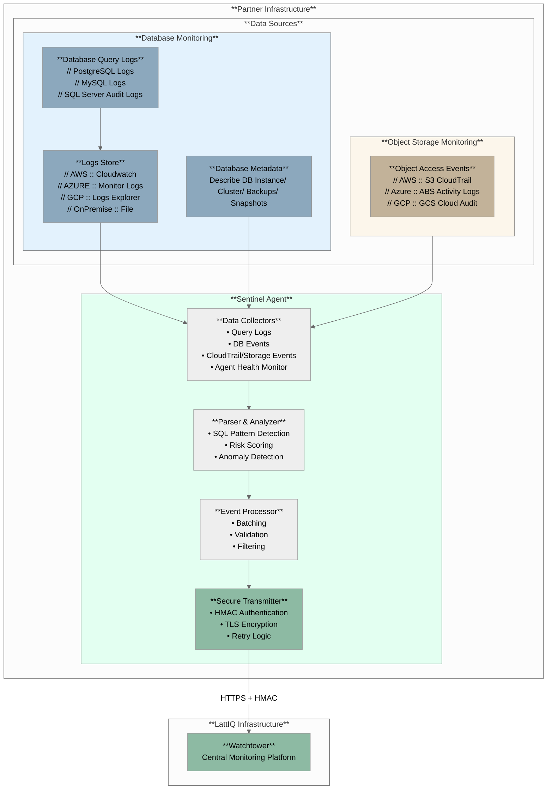

# Sentinel - Data Usage Monitoring Agent

<div align="center">

**LattIQ Sentinel** is a sophisticated monitoring agent designed to provide complete transparency and compliance monitoring capabilities for data usage in partner environments.

[](https://golang.org/)
[](https://aws.amazon.com/sdk-for-go/)
[](#)
[](#)

</div>

## 🚀 Overview

LattIQ partners with enterprise-grade data publishers, including regulated entities, for responsible data procurement. These organizations have strict compliance obligations, particularly with emerging privacy regulations such as India’s Digital Personal Data Protection Act (DPDPA). LattIQ upholds this accountability by ensuring complete transparency between collaborating parties and enforcing strict purpose-limitation on data usage to prevent abuse. **Sentinel** ensures compliance, monitors
usage patterns, and provides real-time visibility into how data is being accessed and utilized.

### Core Purpose

Sentinel operates within your infrastructure to monitor:

- Database query logs for data access patterns
- Infrastructure events (backups, snapshots, replications)
- Object/File-based data access in cloud storage (S3, Azure Blob, GCS)
- System health and compliance metrics

> **Critical**: Sentinel monitors _metadata and access patterns only_ - it never accesses, stores, or transmits your actual business data.

## 🏢 Architecture Overview



### Complete AWS Implementation

- **Database Monitoring**: Real-time PostgreSQL query log analysis via CloudWatch Logs
- **Infrastructure Monitoring**: Complete RDS/Aurora instance, replica, snapshot, and configuration tracking
- **Storage Monitoring**: CloudTrail integration for S3 access patterns and file-based data monitoring
- **Advanced Detection**: Systematic attack detection including ORDER BY pagination and bulk extraction attempts
- **Risk Assessment**: Multi-factor risk scoring with real-time alerting
- **Enterprise Scale**: Production-ready with <50MB RAM, <5% CPU impact, handles 100K+ queries/sec
- **Security First**: HMAC authentication, TLS encryption, zero data access guarantee

---

### Multi-Cloud Ready Architecture

Sentinel is built with a cloud-agnostic architecture designed for future expansion. **Complete AWS implementation** is production-ready today, with the platform designed to support Azure, Google Cloud, and on-premises environments.

---

## 🔒 Security & Privacy Guarantees

### Data Protection

- **Zero Data Access**: Sentinel never accesses your actual business data
- **Metadata Only**: Monitors query patterns, table names, access frequency
- **Local Processing**: All analysis occurs within your infrastructure
- **Encrypted Transmission**: All metadata sent to LattIQ is encrypted in transit

### Enterprise Authentication

- **HMAC Authentication**: Cryptographic verification of all transmissions
- **TLS Encryption**: Industry-standard transport security
- **IAM Integration**: Uses your existing AWS IAM roles and permissions
- **Complete Audit Trail**: Full logging of all Sentinel activities

---

### Documentation References

For detailed information:

- **Business Problem & Solution**: [Business Problem & Solution](docs/Business-Problem.md)
- **Technical Architecture**: [Architecture](docs/Architecture.md)
- **Detection Capabilities**: [Detection Capabilities](docs/Detection-Capabilities.md)
- **Partner Technical Guide**: [Partner Technical Guide](docs/Partner-Technical-Guide.md)

## ⚙️ Configuration

### Environment Variables

```bash
# Client Configuration
export SENTINEL_CLIENT_ID="your-client-id"
export SENTINEL_CLIENT_NAME="Your Organization"
export SENTINEL_ENVIRONMENT="production"

# AWS Configuration
export AWS_REGION="ap-south-1"
export RDS_INSTANCE_NAME="your-rds-instance"
export CLOUDTRAIL_S3_BUCKET="your-cloudtrail-bucket"
export AWS_ACCOUNT_ID="123456789012"

# Logging
export SENTINEL_LOG_LEVEL="info"
```

### Configuration File (`configs/sentinel.yaml`)

```yaml
client:
  id: "${SENTINEL_CLIENT_ID}"
  name: "${SENTINEL_CLIENT_NAME}"
  environment: "${SENTINEL_ENVIRONMENT:-production}"

watchtower:
  endpoint: "https://api.lattiq.com"
  secret_key: "your-hmac-secret-key"
  timeout: 30s
  compression: true

data_sources:
  query_logs:
    enabled: true
    log_group: "/aws/rds/instance/${RDS_INSTANCE_NAME}/postgresql"
    poll_interval: 30s
    batch_size: 100
    log_format:
      log_line_prefix: "%t:%r:%u@%d:[%p]:"
      auto_detect: true

  rds:
    enabled: true
    instances: ["${RDS_INSTANCE_NAME}"]
    poll_intervals:
      instances: 15m
      config: 30m
      snapshots: 30m

  cloudtrail:
    enabled: true
    s3_bucket: "${CLOUDTRAIL_S3_BUCKET}"
    s3_prefix: "AWSLogs/${AWS_ACCOUNT_ID}/CloudTrail/${AWS_REGION}/"
    event_names:
      - "CreateDBSnapshot"
      - "RestoreDBInstanceFromDBSnapshot"
      - "CreateDBInstanceReadReplica"
    poll_interval: 5m

features:
  tables:
    customers:
      database: "production_db"
      schema: "public"
      lattiq_columns:
        - "risk_score"
        - "churn_probability"
        - "fraud_indicator"
        - "lifetime_value_score"
      primary_key: ["customer_id"]
      description: "Customer master table with LattIQ ML features"

    transactions:
      database: "production_db"
      schema: "public"
      lattiq_columns:
        - "anomaly_score"
        - "risk_category"
      primary_key: ["transaction_id"]
      description: "Transaction table with LattIQ risk features"

batch:
  max_size: 100
  max_age: 30s
  compression: true

health:
  enabled: true
  report_interval: 5m
```

---

## 🛠️ Installation & Deployment

### Enterprise Deployment Models

Sentinel provides flexible deployment options for enterprise environments:

#### **Lightweight Agent**

- Single binary deployment
- Minimal resource footprint (50-200MB RAM, 0.1-0.5 cores)
- Docker container support available
- **Recommended**: Dedicated compute instance for monitoring

#### **Performance & Scale**

- **Handles**: 1K-100K+ queries per second
- **Network**: Minimal usage (batched transmission every 30s)
- **Storage**: <100MB for logs and temporary data
- **Scalability**: Horizontal scaling through multiple agents

### Prerequisites

- **Go 1.22+** for building from source
- **AWS Credentials** with appropriate IAM permissions
- **PostgreSQL RDS/Aurora** with query logging enabled (`log_statement = 'all'`)
- **CloudWatch Logs** integration for PostgreSQL logs
- **CloudTrail** enabled for S3/infrastructure monitoring

### Production Deployment

#### 1. **AWS IAM Permissions**

```json
{
  "Version": "2012-10-17",
  "Statement": [
    {
      "Effect": "Allow",
      "Action": [
        "logs:DescribeLogGroups",
        "logs:DescribeLogStreams",
        "logs:GetLogEvents",
        "logs:FilterLogEvents"
      ],
      "Resource": "arn:aws:logs:*:*:log-group:/aws/rds/instance/*/postgresql"
    },
    {
      "Effect": "Allow",
      "Action": [
        "rds:DescribeDBInstances",
        "rds:DescribeDBSnapshots",
        "rds:DescribeDBParameters",
        "rds:DescribeDBParameterGroups"
      ],
      "Resource": "*"
    },
    {
      "Effect": "Allow",
      "Action": ["s3:GetObject"],
      "Resource": "arn:aws:s3:::cloudtrail-bucket/*"
    }
  ]
}
```

#### 2. **PostgreSQL Configuration**

```sql
-- Required settings for monitoring
log_statement = 'all'
log_duration = on
log_connections = on
log_disconnections = on
log_temp_files = 0  -- Critical: Detects bulk operations
log_lock_waits = on -- Useful: Concurrent access patterns
log_line_prefix = '%t:%r:%u@%d:[%p]:'
```

#### 3. **CloudWatch Integration**

Ensure PostgreSQL logs are streamed to CloudWatch via RDS configuration.

---

## 🚀 Getting Started

### Quick Setup

1. **Deploy Agent**: Set up compute instance or container per resource requirements
2. **Configure Access**: Set up IAM roles and policies for CloudWatch, RDS, S3 access
3. **Update Configuration**: Customize `sentinel.yaml` for your environment
4. **Verify Connectivity**: Test connection to LattIQ Watchtower
5. **Monitor Dashboard**: Access real-time monitoring via LattIQ platform

### Build and Run

```bash
# Build the application
go build -o sentinel ./cmd/sentinel

# Run with default config
go run ./cmd/sentinel

# Run with custom config file
go run ./cmd/sentinel -config ./configs/sentinel.yaml

# Enable debug logging
go run ./cmd/sentinel -debug
```

### Development Commands

```bash
# Run all tests
go test ./...

# Run tests with verbose output
go test -v ./...

# Format Go code
go fmt ./...

# Vet Go code for potential issues
go vet ./...
```

---

## 📊 Enterprise Features

- **Complete AWS Integration**: Production-ready monitoring for RDS, Aurora, S3, CloudTrail
- **Real-time Processing**: Sub-second query analysis and alerting
- **Compliance Ready**: Built for regulated industries and privacy requirements
- **Multi-tenant Architecture**: Supports multiple client deployments
- **Professional Support**: Dedicated technical support and customization

---

_This document provides a comprehensive overview of LattIQ Sentinel's enterprise monitoring capabilities. For specific implementation details and customization options, please contact the LattIQ technical team._
