# 🏗️ Architecture

## System Overview

```mermaid
graph TB
    subgraph "Sentinel Agent"
        subgraph "Main Orchestrator"
            Agent["Agent<br/>(internal/agent)"]
        end

        subgraph "Data Collection Layer"
            QLCollector["Query Logs Collector<br/>(CloudWatch)"]
            RDSCollector["RDS API Collectors<br/>(Instances, Snapshots)"]
            CTCollector["CloudTrail Collector<br/>(S3 Events)"]
            HealthMonitor["Health Monitor"]
        end

        subgraph "Data Processing & Analysis Layer"
            Parser["Parser Package<br/>• SQL Parsing<br/>• Risk Scoring<br/>• Log Analysis"]
            Analyzer["Analyzer Package<br/>• Pattern Detection<br/>• Session Tracking<br/>• Systematic Attacks"]
        end

        subgraph "Event Processing Pipeline"
            EventProcessor["Event Processor"]
            HTTPTransmitter["HTTP Transmitter<br/>(HMAC Auth)"]
        end
    end

    subgraph "External Services"
        LattIQService["LattIQ Service<br/>(Hub/Databridge)"]
    end

    %% Data flow connections
    QLCollector --> Agent
    RDSCollector --> Agent
    CTCollector --> Agent
    HealthMonitor --> Agent

    Agent --> Parser
    Agent --> Analyzer
    Parser --> EventProcessor
    Analyzer --> EventProcessor

    Agent --> EventProcessor
    EventProcessor --> HTTPTransmitter
    HTTPTransmitter --> LattIQService

    %% Styling
    classDef collector fill:#e1f5fe,stroke:#01579b,stroke-width:2px
    classDef processor fill:#f3e5f5,stroke:#4a148c,stroke-width:2px
    classDef transmitter fill:#e8f5e8,stroke:#1b5e20,stroke-width:2px
    classDef external fill:#fff3e0,stroke:#e65100,stroke-width:2px

    class QLCollector,RDSCollector,CTCollector,HealthMonitor collector
    class Parser,Analyzer,EventProcessor processor
    class HTTPTransmitter transmitter
    class LattIQService external
```

## Event Processing Pipeline

**Key Implementation Details:**

- **Event Batching**: Agent accumulates up to 100 events or waits 30 seconds before processing
- **Message Creation**: EventProcessor converts typed events to standardized MonitoringMessage format
- **Security**: HMAC-SHA256 authentication with configurable secret key
- **Reliability**: Exponential backoff retry logic with up to 3 attempts
- **Performance**: Optional gzip compression and connection pooling
